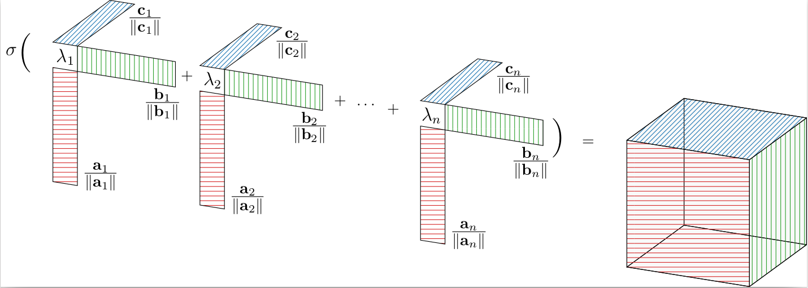

# Canonical convolutional neural networks
This is the official PyTorch implementation of Canonical convolutional neural networks.

## Overview

### Abstract
This paper formulates canonical weight normalization for convolutional neural networks. Canonical networks express their weight tensors as scaled sums of outer vector products. The canonical tensor decomposition inspires our formulation and serves as an initialization tool. We train network weights in the decomposed form. Similar to established weight normalization, we include a global scaling parameter and add scales for each mode. Our formulation allows us to compress our models conveniently by truncating the parameter sums. We find that our re-parametrization leads to competitive normalization performance on the MNIST, CIFAR10, and SVHN data sets. Once training has converged, we find that our formulation simplifies network compression.

### Reparameterization framework


## Code Usage
### Requirements

Install the following required packages
1. Numpy - 1.18.5
2. Python - 3.8.5
3. Tensorly - 0.5.1
4. Torch - 1.7.0
5. Torchvision - 0.8.1
6. Tensorboard

### Normalization 

For training the AlexNet model
``` bash
$ python scripts/AlexNet/alexnet.py --lr=<lr> --epochs=<epochs> --optimizer=<optimizer> --mode=<mode> --data_set=<dataset> --init_method=<initialization>
```
- Optimizer can be 'SGD' or 'RMSPROP' or 'ADAM' (default: 'SGD')
- Mode can be (default: 'None')
    - 'None' for normal training
    - 'CP' for CP normalization
    - 'Weight' for Weight normalization
- Dataset can be (default: 'cifar-10')
    - 'cifar-10'for CIFAR-10 datset
    - 'SVHN' for Street View House Number dataset
- Initialization method (default: 'CPD')
    - 'CPD' for CPPower initialization
    - 'KNORMAL' for kaming normal initialization
    - 'KUNIFORM' for kaming uniform initialization
- An automatic model saving is enabled

For training the LeNet model
``` bash
$ python scripts/LeNet/mnist.py --lr=<lr> --epochs=<epochs> --optimizer=<optimizer> --mode=<mode> --save-model --init_method=<initialization>
```
- save-model to save the current model
- Other hyperparameters are the same as discussed above

### Compression
Note: To apply the compression, the saved model is a must.

For compression on AlexNet model, 
``` bash
$ python scripts/AlexNet/alexnet.py --lr=<lr> --epochs=<epochs> --optimizer=<optimizer> --mode=<mode> --data_set=<dataset> --compress_rate=<Compress rate> --resume --name=<saved model path>
```
- compress_rate states the percentage of compression
- name is the path to the saved model
- resume boolean value to load the specified checkpoint

For compression on LeNet model
``` bash
$  python scripts/LeNet/mnist.py --lr=<lr> --epochs=<epochs> --optimizer=<optimizer> --mode=<mode> --save-model --resume --name=<save model path> --compress_rate=<Compress rate>
```

To know more about the hyperparameters (arguments), please use
``` bash
$ python <corresponding .py file> --h
```
